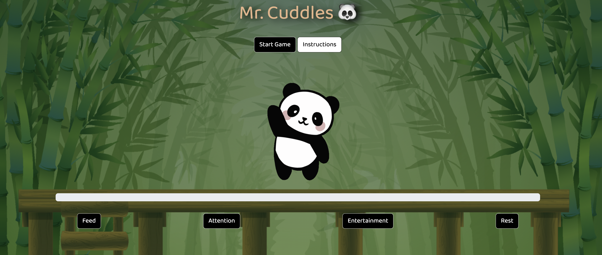
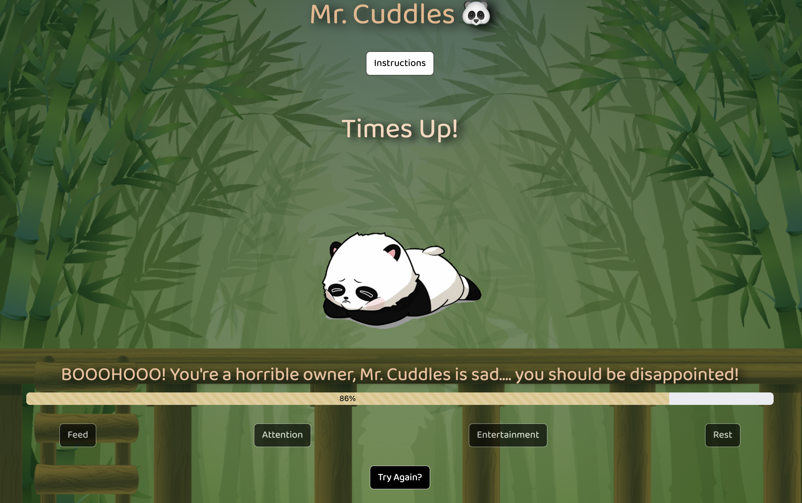

## __Title: Taking care of Mr. Cuddles__ 

## Getting Started: #
  * https://mrcuddles.netlify.app/

  * __Instructions :__
    * You just became a new pet owner of Mr. Cuddles. You have to take care of Mr. Cuddles in many different ways. If you don't properly take care of him, he will be sad and we will take him away from you. Keep him happy by giving him what he needs in the moment. You want his mood bar to be filled so you can keep him. 

## Screenshots: 
 
 
## Technologies Used: 
  * JavaScript
  * HTML
  * CSS

## Credits: 

## Next Steps: 
  - [ ] Add a startup screen where it gives you instructions.
  - [ ] Add an option to choose different pets.
  - [ ] Make the pet look more lively.
  - [ ] Add Dark Mode.
  - [ ] Add feature where the user can rename the pet.
  - [ ] Add feature where if the wrong button is pressed, the mood bar goes down.

